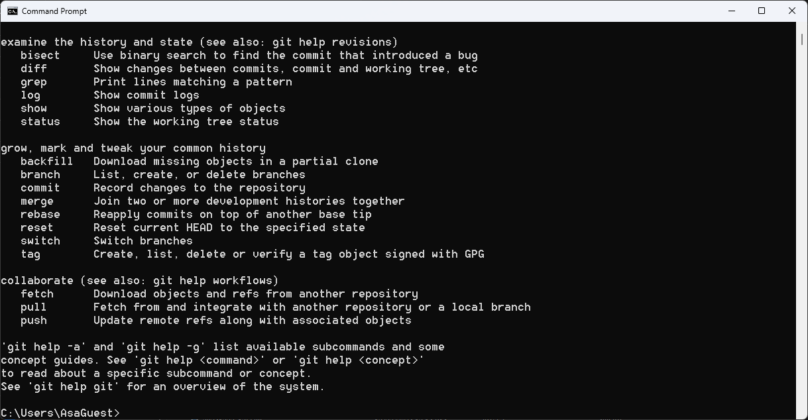

# Kitting Optimization 
This is an application used for matching printed circuit board layers. The method used is brute force.

## Table of Contents
1. Requirements
2. Installation Steps

# Requirements
Please install the items in this order

** Nice to have but not required
1. [Python 3.12]()
2. [Pip]()
3. [Git]()
4. [DB Browser**]()

## Requirements Installation
### Python
1. Click [here](https://www.python.org/ftp/python/3.12.8/python-3.12.8-amd64.exe) to download the python 3.12 installer for 64-bit computers (likely).
2. In your downloads folder, open the installer
3. Follow steps 2 - 5 in the pdf [here](https://cse.unl.edu/~lksoh/Classes/CSCE100_Fall20/install/PythonInstallation_WINDOWS.pdf)
4. Open a command prompt by searching for "cmd" in your windows search bar
5. In the command prompt type python --version. You should see "Python 3.12.7" displayed. If you see a different Patch version (The last number, .7 in the case below), you can still continue. 

### Git
1. Click [here](https://github.com/git-for-windows/git/releases/download/v2.47.1.windows.1/Git-2.47.1-64-bit.exe) to download git
2. In your downloads folder, run the installer leaving all preset conditions
3. Open up an additional command prompt and type "git". You will see something like the image below 
### DB Browser
1. Click [here](https://download.sqlitebrowser.org/DB.Browser.for.SQLite-v3.13.1-win64.msi) to download the DB browser
2. In your downloads folder, open the installer and keep all preset values

# Installation
1. Wherever you want the program to be run from, navigate there in a command prompt. I will choose my downloads' folder. 
2. Type the command `git clone https://github.com/ace15guest/KittingOptimization.git` 
## Running the program
# Panel Creation
1. In the command prompt where the project is downloaded type `python panel_creation.py`
# Image Defects
1. In the command prompt where the project is downloaded type `python image_defects.py`
# Optimization
1. In the command prompt where the project is downloaded type `python optimization.py`
